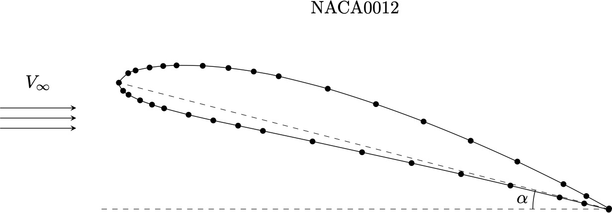
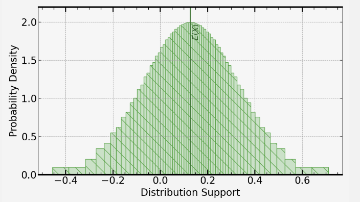
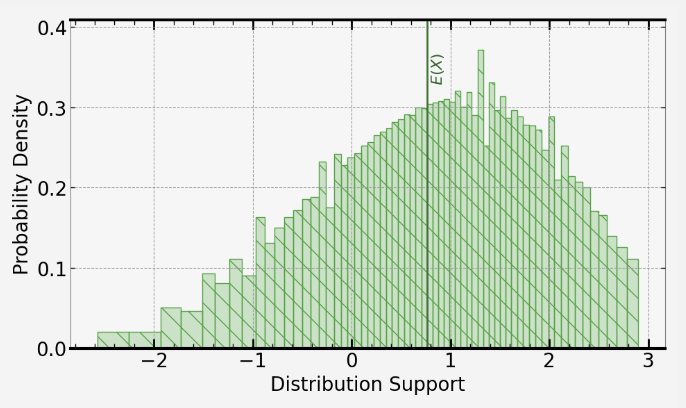

[](https://signaloid.io/repositories?connect=https://https://github.com/mieksleb/Aerofoil)
[](https://signaloid.io/repositories?connect=https://https://github.com/mieksleb/Aerofoil)

# Aerofoil Lift Coefficient

This package contains a C-program that determines the lift coefficient $C_L$ of a 2D aeroifoil (airfoil) using the Smith-Hess Panel method [[1]](https://www.annualreviews.org/doi/10.1146/annurev.fl.22.010190.001351)
 as a function of the aerofoil geometry and the angle of attack $\alpha$. Uncertainty distributions in $C_L$ are then calculated usign the Signaloid.io cloud platform. This allows for the fast and efficient calculation of the distribution in $C_L$ given a distribution of input parameters. This allows for the determination of how error propogates through the program without having to execute the program for each sample of the distribution.

A more detailed description for the Hess-Smith panel method can be found [here](src/README.md). There are two versions of the aerofoil program, one for local use, and the other for the use on the Signaloid platform.

Below is a schematic diagram of the Naca0012 aerofoil with angle of attack $\alpha$.




# Local Compilation

 The [local_src](local_src) directory includes all the system files required for local compilation. The program is simply compiled using the make command:

```bash
make
```
Make any appropriate changes to Makefile including the C-compiler and debug flags. The compiled program is called aerofoil.exe.

 ## Usage

You can execute the program with the command line arguments alpha as follows:

```bash
./aerofoil file_name alpha
```

This returns the number of data points for the aerofoil, the number of panels used in the calculation and the lift coefficient. For example for the aerofoil data file naca0012.dat at and angle of attack of $8^{\circ}$, the lift coefficient is calculated to be $C_L=0.9375$.


# Running on Signaloid.io

To run this program on the Signaloid.io cloud compute services, simply click on the signaloid icon at the top of the page. If you have compute time then you can compile and run this code with the green play button, this is done automatically using the config.mk makefile. The compiled program now takes in distributions for the input variables. For example the command line arguments are now the mean angle of attack $\left<\alpha\right>$, and its standard deviation $\sigma_{\alpha}$. Command line arguments are parsed into the field accessible by clicking on the appropriate icon.

Distributions are defined from the **UxHw** library. For example a Gaussian distribution of the variable $\alpha$ with mean $\left<\alpha\right>$ and standard distribution $\sigma_{\alpha}$ is defined by:
```c
double alpha = UxHwDoubleGaussDist(alpha_mean, alpha_std);
```

Any print statments of variables defined as distributions automatically produce uncertainty plots which can be viewed.

# Uncertainty Results

The most relevant work on uncertainty in the angle of attack measurement is that of Paschereit _et al._ [[2]](https://wes.copernicus.org/articles/5/1771/2020/). In said paper, uncertainty ranges for various values of $\alpha$ are given based on the surface pressure measurement method, e.g. for some standard conditions they report $\alpha=7.3^{\circ}\pm0.2^{\circ}$. It is not described explicitly how these values are distributed but it is shown that $\alpha$ is approximately bell-shaped with repsect to the roll $\phi$ and so we will make the assumption that the distribution in $\alpha$ is Gaussian in nature. Choosing a mean value of $\left<\alpha\right>=7.3^{\circ}$ and a standard deviation of $\sigma_{\alpha}=0.2^{\circ}$, the $\alpha$ distribution outputted by the Signaloid processor was:



The corresponding output for $C_L$ was:



The mean and standard deviation of $C_L$ were calculated using the **UxHwDoubleNthMoment** function to calculate the first two moments.
```c
double expected = UxHwDoubleNthMoment(C_lift, 1);
double std = sqrt(UxHwDoubleNthMoment(C_lift, 2) - pow(UxHwDoubleNthMoment(C_lift, 1),2));
```
This leads to $\left< C_{L} \right> =0.76233$ and $\sigma_{C_{L}}=0.88897$.

We observe a slightly skewed bell-shaped distribution in $C_L$ with the expected value lying to left of the central peak in probability density. This implies that a Gaussian assumption of uncertainty in the angle of attack leads to a qualitatively Gaussian distribution in the coefficient of lift. However, due to the skew of the distribution we are more likely to over-predict the value of $C_L$. This could be potentially harmful as overestimating an essential quantity such as the coefficient of lift could lead to aerofoils being deemed to have sufficient lift for angles of attack which in reality will not yield sufficient lift.